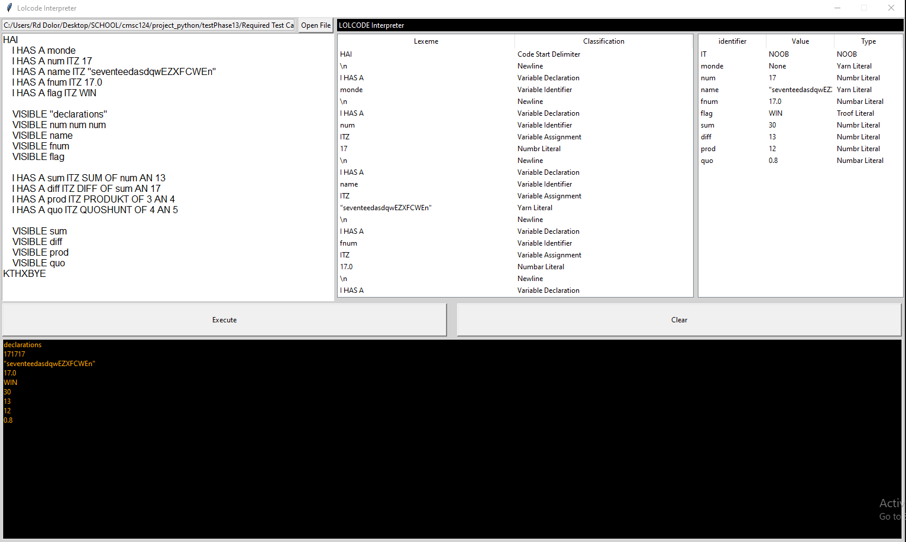

# LOLCODE Interpreter using Python

## Images

## Requirements:

- For the program to be able to run, the user must have the current version of Python installed on their device.
- Make sure to add install it correctly and add it to the PATH as well.
- Another thing to note is to make sure that the library for Tkinter is also available to use with the current Python installation. Tkinter should come with all Python installations so that should have it covered.
- Install the latest version of python here: https://www.python.org/downloads/

## How to run the program

- With the all of the requirements accomplished, we simply have to run the file `gui.py` by either running it via the command terminal of your device or simply double clicking the `gui.py` file.
- To run it from the terminal, simply open the terminal and go to the directory where the files from this program are present. Make sure that all of the `.py` files are in the same directory
- From there, simply input the ff: `python gui.py` for Windows or `python3 gui.py` for Linux and the program should be able to run.

### Program written by Ronel Dylan Joshua Dolor, Brian Angelo Loria, and Chad Andrei Enriquez
*Made Without Github*
